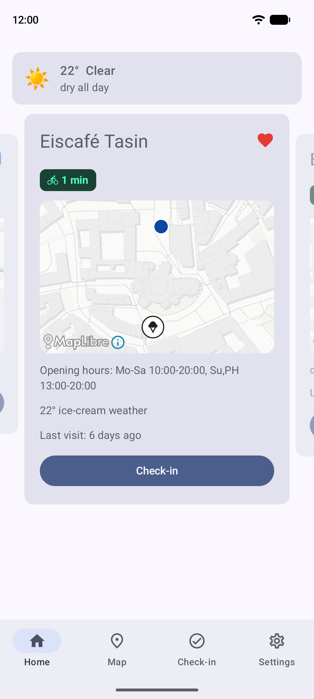
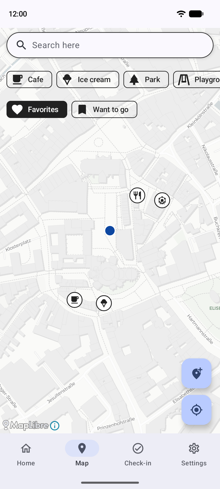
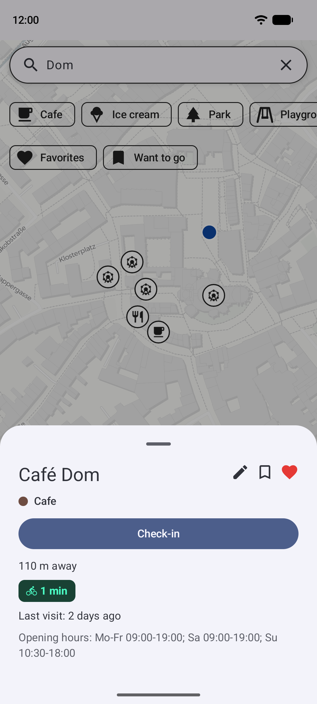
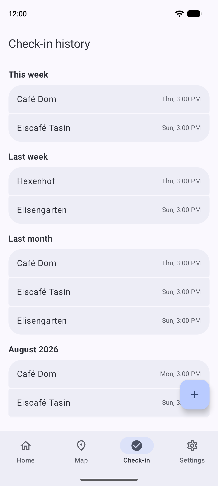
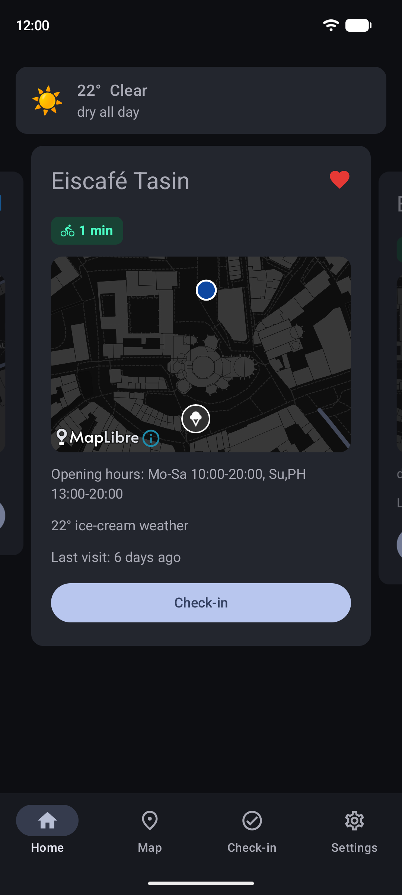

# Freizeit

What to do with your free time: your favorite places around Aachen, suggested by distance, weather and opening hours.

<table>
  <tr>
    <td></td>
    <td></td>
    <td></td>
    <td></td>
    <td></td>
  </tr>
</table>

- **Suggestions** from your favorite and want-to-go places, ranked by distance, weather and whether they're open
- **Map** of playgrounds, parks, cafés, ice cream and more from OpenStreetMap, with category filters and search
- **Mark** places as favorite or want-to-go, and add your own places the map doesn't know
- **Check in** when you visit — manually or from a nearby-place notification — and see your history
- **Widget** on the home screen with today's top 3 suggestions
- **Back up** and restore your places and check-ins

Screenshots show real OpenStreetMap places around Aachen Markt with made-up favorites and visits;
map data © OpenStreetMap contributors, map style © CARTO. Regenerate with `./gradlew readmeScreenshots`
(needs a running emulator; wipes the app's data on it).

## Build

Android 8+ (API 26), Android Studio, JDK 17–21 (Android Studio's bundled JBR works; newer JDKs break Gradle 8.5).
Clone, open, run.

For everyday use install the release build: `./gradlew installRelease` (or `assembleRelease`, then
`adb install -r app/build/outputs/apk/release/app-release.apk`). It is signed with the same debug keystore
and uses the same app id as the debug build, so it installs over a debug install and keeps your places,
check-ins, settings, geofences and widget. Only the release build uses the real 15-minute dwell before a
check-in notification (the debug build fires after 30 s). Export a backup in Settings first as a safety net.

The app starts empty. Generate a `pois.json` with [`tools/poi_extraction`](tools/poi_extraction) from any
OpenStreetMap `.osm.pbf` extract (for example from [Geofabrik](https://download.geofabrik.de/)), then import it in Settings.

Built with Kotlin, Jetpack Compose, Room, MapLibre, Glance and WorkManager; weather from Open-Meteo.
Developed with [Claude Code](https://claude.ai/code).
